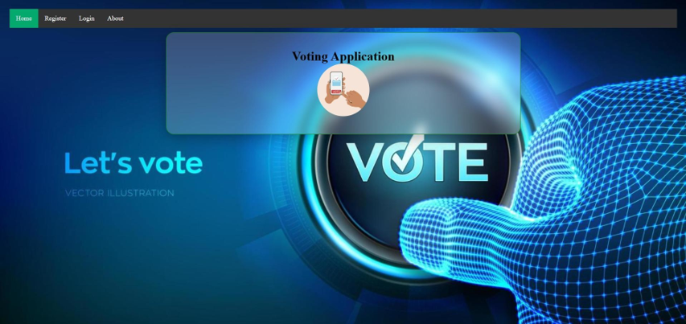
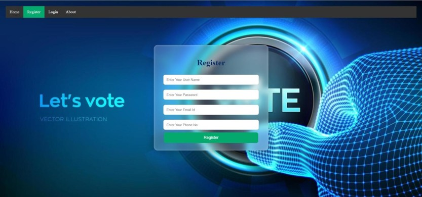

Name: Nikita Bhor 
Course: MCA 
Technologies: Java, Spring Boot, Hibernate (JPA), Thymeleaf, MySQL, HTML, CSS, Maven 
Application Features: 
•	User can vote the Candidate. 
•	Admin has the permission to see the vote details. 
Technology used in this Project: 
•	i) Thymeleaf,CSS : designing page layout. 
•	ii) Java : all the logic has been written in java. 
•	iii) MySQL: MySQL database has been used as database. 
•	iv) SpringSecurity: SpringSecurity has been used for authentication. 
•	v) Hibernate: Hibernate ORM is used. 
Software And Tools Required: 
•	Java JDK 8+ 
•	Eclipse IDE 
•	MySQL 
 
➢ Technical Summary 
Project Description: 
The E-Voting Management System is a web application that allows users to register, log in, and cast votes securely. Admin can manage candidates and voting data is stored in MySQL. 
Frontend 
•	HTML 
•	CSS 
•	Bootstrap 
•	Thymeleaf 
Backend 
•	Java  
•	Spring Boot  
•	Spring MVC  
•	Spring Data JPA (Hibernate)  
•	Spring Security 
Database 
•	MySQL 
•	Database Name: zinterview 
Build Tool 
•	Maven 
Server 
•	Embedded Apache Tomcat 
Tables 
•	User 
•	Candidate 
•	hibernate_sequence 
Main Features 
•	User Registration  
•	User Login  
•	Admin Login  
•	Candidate Management  
•	Online Voting  
•	One Vote Per User  
•	Vote Count Storage  
•	Dashboard  
•	About Page 
 
Controllers 
•	AdminController 
•	CandidateController 
•	HomeController 
•	UserController  
APIs 
•	GET / 
•	GET /home 
•	GET /register 
•	GET /login 
•	GET /dashboard 
•	GET /vote 
•	GET /about 
 
POST APIs 
•	POST /createuser 
•	POST /login POST /vote 
Project Workflow 
Home → Register → Login → View Candidates → Cast Vote → Vote Stored in MySQL → Result Display 
File Structure Screenshot 
   
## Home Page

  
 ## Registration Page 
.
  
Login Page 
  
   
Voting Page 
  
  
  
  
   
 	 
Admin Dashboard 
  
Candidate List 
 
ABOUT PAGE 
   
Database (User & Candidate Tables) 
  
